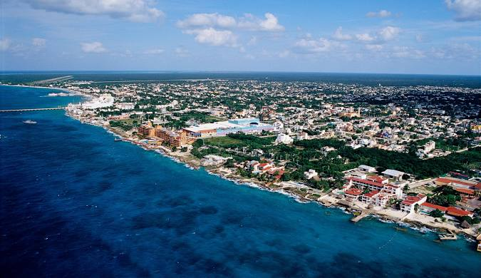

---

## title: "Cozumel: San Miguel on Foot"

## Overview

Cozumel is one of the more cruise-saturated ports in the Caribbean, but it also offers a genuine town experience if you leave the pier efficiently and spend your time in **San Miguel de Cozumel**, where most locals live and work.

This plan is intentionally **loose**. The goal is to anchor about half the day with an easy structure, then leave room to wander, sit, eat, or change direction based on how the town feels.

This is a **self-directed, walking-focused day** with local food, shaded plazas, and everyday life — not an excursion and not a beach day.

---

## Cruise Docking & Getting to Town

MSC ships most often dock at **Puerto Maya** or the **International Cruise Terminal**, both south of downtown San Miguel.

From either pier, the best move is to **take a taxi immediately** rather than linger near the terminal shops.

* Taxi time: ~10 minutes
* Typical fare: ~$8–$10 USD (confirm before entering)
* Destination to request: **"Plaza Benito Juárez" or "Centro / downtown San Miguel"**

Taxis are plentiful, regulated, and straightforward. This quick hop cleanly removes you from the cruise bubble.

---

## Anchor Point: Plaza Benito Juárez

Start your walk at **Plaza Benito Juárez**, the town’s central square. This is a lived-in space, not a tourist set piece.

You’ll find benches, shade, families, vendors, and locals meeting friends or passing through. It’s an excellent place to orient yourselves and decide whether to head inland first or toward the water.

Nearby are a small church, municipal buildings, and everyday shops — all signs you’re in the real town.

---

## Wandering Inland: Neighborhood Streets & Local Life

From the plaza, walk **inland a few blocks** (away from the water). The further you get from the waterfront, the more the crowd thins and the more local the town feels.

This is where San Miguel shines for slow travel:

* Panaderías and corner bakeries
* Small taquerías and lunch counters
* Fruit stands and convenience shops
* Schools, clinics, and people on normal errands

Look for places with locals waiting or eating. These are often simple, fast, and excellent.

This part of the day works well without a map — just wander, pause when something smells good, and sit when it feels right.

---

## Food Strategy (Local, Casual, Flexible)

Rather than targeting a single restaurant, aim for **one main food stop** and allow room for a second if something catches your eye.

Good signs:

* Lines of locals
* Menus on chalkboards or walls
* Plastic chairs, quick turnover, relaxed atmosphere

You’ll find strong options for tacos, guisados, seafood, and casual cafés within a 10–15 minute walk of the plaza.

This is a good moment to slow down, hydrate, and people-watch.

---

## Optional Waterfront Loop

If you want open views and a breeze, walk back toward **Avenida Rafael E. Melgar**, the main waterfront road.

This area is more tourist-facing but still pleasant, especially if you treat it as a **short scenic loop** rather than a shopping corridor.

You can:

* Sit facing the water with a drink
* Watch ferries and passing locals
* Use it as a transition back inland for another wander

---

## Suggested Time Shape (Very Flexible)

* **0:00–0:45** – Taxi from pier to downtown, coffee or light snack
* **0:45–2:00** – Inland wandering, plazas, local food
* **2:00–3:30** – Sit-down meal or second food stop, people-watching
* **3:30–4:30** – Optional waterfront stroll, souvenir browsing off main drag
* **Return** – Taxi back to pier with generous buffer

You can shorten or extend any phase without breaking the day.

---

## Safety & Comfort Notes

* Downtown San Miguel is generally calm and comfortable during the day
* Stay on well-trafficked streets and plazas
* If an area feels off, simply change direction — the grid makes this easy
* Keep an eye on ship time and plan to head back early rather than rushed

---

## Why This Works

This plan avoids the cruise-commercial zone, minimizes crowd exposure, and maximizes the chance of small, human moments — the kind that tend to become lasting travel memories.

It’s not about seeing *everything*. It’s about having a good few hours, then returning to the ship relaxed.
