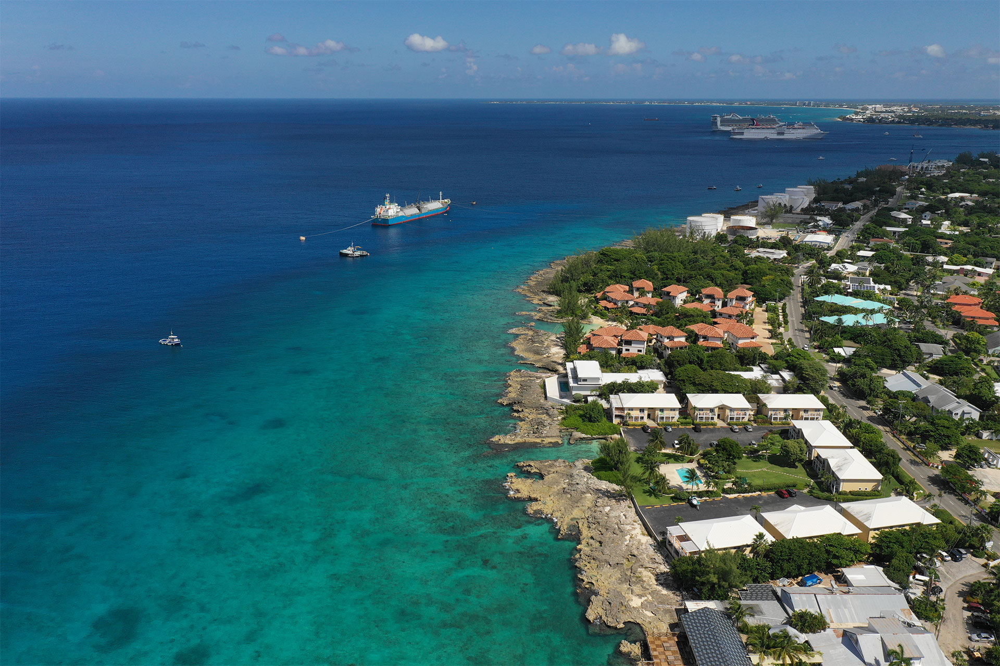
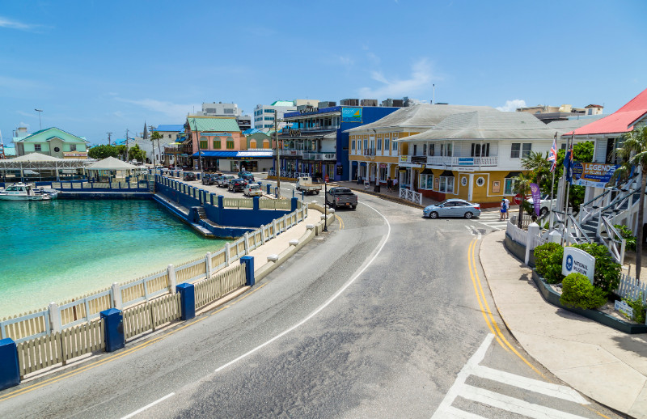

## Grand Cayman: South Sound (Independent Coastal Walk)

## Overview

South Sound is a **local, lived-in coastal stretch** just south of downtown George Town. It’s not a beach destination and not an attraction zone — it’s where people jog, fish, walk dogs, and sit by the water at the end of the day.

For an independent port day, this is one of the best places on Grand Cayman to experience the island without cruise energy. The reward here is **atmosphere**, not a checklist.

This plan is deliberately simple: taxi out, walk the coast, stop when something feels right, eat something local, and leave whenever you’re ready.

---

## Getting There

From the George Town tender dock, take a **taxi to South Sound Road**.

* Taxi time: ~10–15 minutes
* What to say: “South Sound Road, near the coast”

Any local driver will know the area. You don’t need a precise address — this is about choosing a stretch and walking.

---

## The Walk: South Sound Road

South Sound Road runs along the water with sidewalks and low coastal walls. You’ll be walking **beside ironshore and open sea**, not sand.

What makes this walk good:

* Constant ocean views and breeze
* Locals fishing, swimming, and exercising
* No cruise groups or vendors
* Easy to turn around whenever you like

This is a *stop-and-sit* kind of walk. Lean on a wall, watch the water, talk, and move on when you feel like it.

Swimming is optional and conditions-dependent. If the water looks rough or uninviting, don’t force it — the walk alone is the point.

---

## Points of Interest (Low-Key, Real)

These aren’t attractions so much as **things worth noticing** as you pass:

**Coastal Fishing Spots**
You’ll often see locals fishing from the ironshore. It’s quiet, unshowy, and very much part of daily life here.

**Residential Architecture**
South Sound has an interesting mix of modern island homes, older concrete structures, and hurricane-practical design. It’s a good place to notice how people actually build and live on the island.

**Street Art & Small Murals**
There’s no formal street-art district, but you’ll occasionally see small murals or painted walls tucked into side streets and near local shops. These change over time — treat them as bonuses, not targets.

---

## Food Strategy (Local, Casual)

South Sound isn’t dense with restaurants, which is part of why it stays calm. The move here is **one simple local stop**, not a destination meal.

A few reliable approaches:

* **Small neighborhood cafés or take-away spots** along or just inland from South Sound Road
* **Fuel-station food counters** (surprisingly good and very local in Cayman)
* Asking a taxi driver or a local fisherman where *they*’d grab lunch nearby

You’re looking for jerk chicken, fish, rice and beans, patties, or simple plates — not a polished dining room.

If nothing grabs you immediately, it’s fine to eat later. Hunger is a feature, not a failure.

---

## Optional Pivot Points

If South Sound isn’t clicking for any reason:

* Taxi back toward George Town for a short waterfront walk
* Head north briefly to a café or market area
* Regroup with others elsewhere on the island

This plan has **no sunk cost** — that’s the advantage.

---

## Suggested Time Shape (Very Flexible)

* **0:00–0:30** – Tender ashore, taxi to South Sound
* **0:30–2:00** – Coastal walk, sitting, observing
* **2:00–3:00** – Casual local food stop
* **3:00+** – Decide whether to continue, pivot, or head back

You’ll likely be done well before ship time, which is exactly right.

---

## Safety & Comfort Notes

* This is a daytime, residential area — calm but unpolished
* Stay on main roads and coastal paths
* Trust your instincts; turning around is always easy
* Sun and wind can be stronger here than expected

---

## Why This Works

South Sound gives you something many cruise ports can’t: **space to notice things**.

No schedules, no selling, no performance — just coastline, conversation, and the feeling of being somewhere real for a few hours before returning to the ship.
