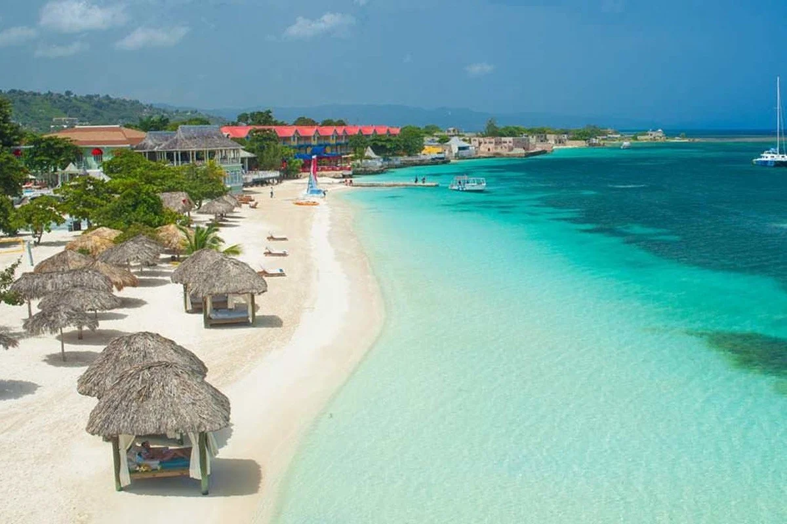
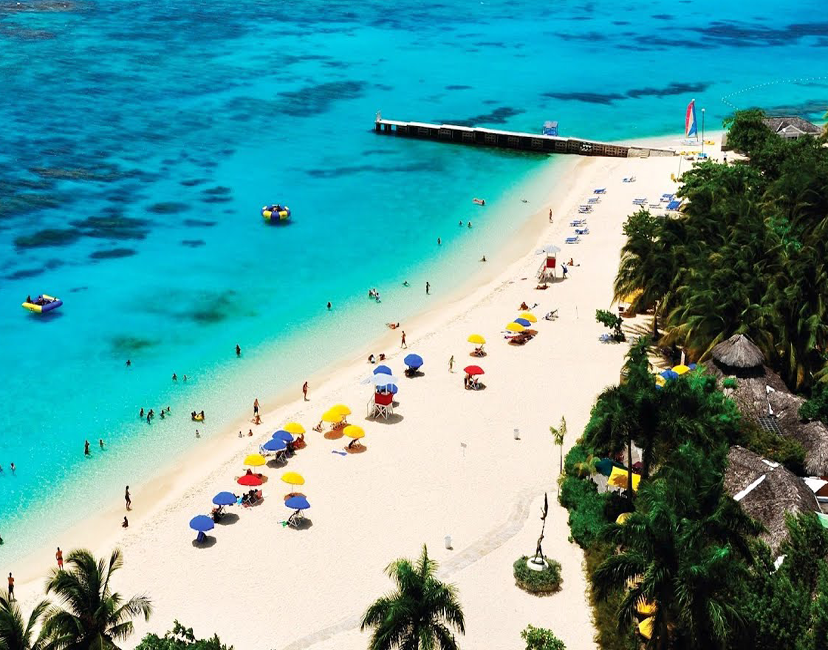
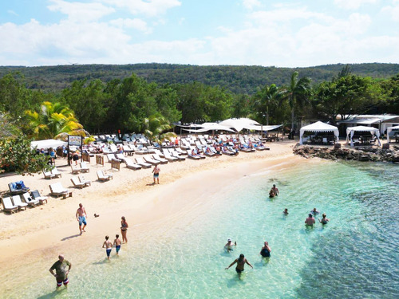

## Montego Bay: Beach Day Options (Choose-One, Low Stress)

## Overview

Montego Bay works best as a **contained beach-day port**. It’s not ideal for unstructured town wandering, but it *is* well suited to choosing a single beach, settling in, and relaxing without friction.

This page lays out **three beach-day options**, all reachable by safe, straightforward taxi rides. Each option is deliberately bounded, with clear expectations and easy exit points. Pick one based on crowd tolerance and how far you want to travel.

---

## Option 1: Doctor’s Cave Beach (Classic, Controlled, Close)

**Best for:** Easy logistics, calm water, facilities, minimal uncertainty

Doctor’s Cave Beach is the most established beach option in Montego Bay. It’s gated, well-run, and close to the cruise port.

Why it works:

* Clear water, good swimming
* Chairs, umbrellas, restrooms, showers
* On-site food and drinks
* Controlled entry keeps things orderly

Trade-offs:

* Can get busy when multiple ships are in port
* Feels managed rather than natural

**Logistics:**

* Taxi time: ~10 minutes
* Entrance fee required (pay at gate)

This is the “default good choice” if you want reliability over discovery.

---

## Option 2: Cornwall Beach (Quieter, Still Close)

**Best for:** Slightly calmer vibe with similar convenience

Cornwall Beach sits very close to Doctor’s Cave but tends to feel less crowded and a bit more local.

Why it works:

* Similar water quality and swimming conditions
* Fewer people than Doctor’s Cave, on average
* Food and basic facilities available

Trade-offs:

* Smaller footprint
* Fewer amenities

**Logistics:**

* Taxi time: ~10 minutes
* Small entrance fee

If Doctor’s Cave looks packed when you arrive, Cornwall Beach is an easy pivot.

---

## Option 3: Quieter Paid Beach Club (Further Out, More Relaxed)

**Best for:** Fewer cruisers, more space, slower pace

There are several paid beach clubs east or west of Montego Bay that limit numbers and cater more to resort guests and independent travelers.

Why this works:

* More space and fewer people
* Loungers, shade, food, and drinks included or available
* Little to no beach hawking

Trade-offs:

* Longer taxi ride
* Slightly higher cost

**Logistics:**

* Taxi time: ~20–30 minutes
* Day-pass or entry fee

This is the best choice if your priority is *quiet and comfort* over proximity.

---

## Taxi Safety & Practical Notes

Taxis in Montego Bay are widely used by visitors and are generally safe when you:

* Use licensed taxis at the port
* Agree on price before departing
* Stick to direct routes to known beaches

Avoid wandering beaches near the port without a plan; that’s where experiences degrade.

---

## Suggested Time Shape (Any Option)

* **0:00–0:30** – Disembark and taxi to chosen beach
* **0:30–3:00** – Swim, sit, read, eat, relax
* **3:00–4:00** – Decide whether to stay or head back early
* **Return** – Taxi back with buffer

Montego Bay rewards *commitment to one good place*, not hopping.

---

## How to Choose (Morning-Of)

* Want the easiest, safest bet? → **Doctor’s Cave**
* Want similar quality with fewer people? → **Cornwall Beach**
* Want the calmest possible day? → **Paid beach club farther out**

Any of these will give you a solid, low-stress beach day if you ignore everything else.

---

## Why This Works

Montego Bay is best approached with boundaries. By choosing one defined beach and treating it as a half-day anchor, you avoid the noise and pressure that give the port a mixed reputation.

This turns Montego Bay into a **genuinely relaxing stop**, not an endurance test.
